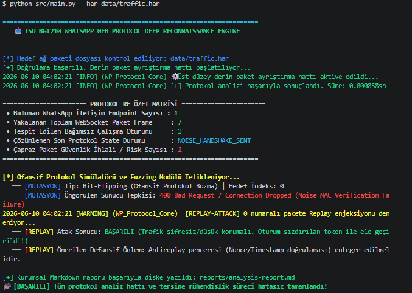

# 🛡️ WhatsApp Web Network Protocol Forensic & Offensive Security Analyzer

<div align="center">
  <a href="https://istinye.edu.tr">
    
  </a>

<br><br>


</div>

---

# 👨‍🏫 Danışman Bilgisi

| Özellik    | Açıklama                                                              |
| ---------- | --------------------------------------------------------------------- |
| Ad Soyad   | Keyvan Arasteh                                                        |
| GitHub     | @keyvanarasteh                                                        |
| E-posta    | [keyvan.arasteh@istinye.edu.tr](mailto:keyvan.arasteh@istinye.edu.tr) |
| LinkedIn   | keyvanarasteh                                                         |
| Web Sitesi | qline.tech                                                            |

# 👩‍💻 Öğrenci Bilgisi

| Özellik    | Açıklama     |
| ---------- | ------------ |
| Ad Soyad   | Begüm Akyüz  |
| Öğrenci No | 2420****1005 |

# 📚 Ders Bilgileri

| Özellik     | Açıklama                                               |
| ----------- | ------------------------------------------------------ |
| Ders Adı    | Tersine Mühendislik Giriş / İleri Ağ Güvenliği         |
| Ders Kodu   | BGT210                                                 |
| Kredi       | 4 AKTS                                                 |
| Ön Koşullar | Python CLI, Wireshark, Ağ Temelleri, Kriptografi Giriş |
| Dönem       | 2025-2026 Bahar                                        |

---

# 🎯 Proje Özeti ve Kapsamı

Bu framework, **WhatsApp Web (web.whatsapp.com)** platformunun ağ katmanı davranışlarını incelemek amacıyla geliştirilmiş bir adli analiz ve protokol araştırma aracıdır.

Sistem;

* HAR (HTTP Archive) dosyalarını işler
* WebSocket (WSS) oturumlarını ayrıştırır
* Binary Frame yapılarını analiz eder
* Entropi tabanlı kriptografik değerlendirmeler yapar
* Protokol durum geçişlerini takip eder
* Otomatik rapor üretir

---

### 🖥️ Canlı Terminal Analiz Çıktısı (Execution Log)

<p align="center">
  
</p>

---


# 🏗️ Sistem Mimarisi

```text
[ 📂 Ham HAR Dosyası ]
        │
        ▼
[ 🔍 Core HAR Parser ]
        │
        ▼
[ 🧪 WSS Frame Extractor ]
        │
        ▼
[ 🧠 Protocol Analyzer Core ]
        ├──► Shannon Entropy Analyzer
        ├──► Finite State Machine
        └──► Protobuf Decoder
        │
        ▼
[ 💥 Offensive Fuzzing Simulator ]
        │
        ▼
[ 📝 Automated Report Generator ]
```

---

# 📂 Repository Yapısı

```text
.
├── .github/
│   └── workflows/
│       └── ci.yml
├── data/
│   └── traffic.har
├── docs/
│   ├── modules/
│   │   └── websocket-parser.md
│   ├── references/
│   │   └── links.md
│   └── research/
│       └── research-notes-template.md
├── reports/
│   └── analysis-report.md
├── src/
│   ├── core/
│   │   ├── crypto_handshake.py
│   │   ├── parser.py
│   │   └── protobuf.py
│   ├── utils/
│   └── main.py
├── tests/
│   └── test_engine.py
├── .env.example
├── .gitignore
├── docker-compose.yml
├── Dockerfile
├── LICENSE
├── Makefile
├── README.md
├── requirements.txt
└── ROADMAP.md
```

---

# 🧠 Teknik Bileşenler

## 📊 Shannon Entropy Analyzer

Paket verilerinin byte dağılımını inceleyerek entropi hesaplaması gerçekleştirir.

Amaç:

* Şifreli trafik tespiti
* Rastgelelik analizi
* Kriptografik yoğunluk ölçümü

---

## ⚙️ Finite State Machine

Handshake süreçlerini durum geçişleri üzerinden takip eder.

Örnek durumlar:

* INIT
* CLIENT_HELLO
* SERVER_HELLO
* HANDSHAKE_COMPLETE

---

## 🎛️ Protobuf Decoder

Düşük seviyeli protobuf alanlarını ayrıştırır.

Desteklenen yapılar:

* Varint
* Field Number
* Wire Type

---

## 💥 Fuzzing Simulator

Kontrollü test ortamında aşağıdaki senaryoları simüle eder:

* Bit-Flipping
* Replay Simulation
* Malformed Packet Testing

---

# 📋 Örnek Analiz Çıktısı

```json
{
  "protocol": "Noise_XX_25519_AESGCM_SHA256",
  "encrypted": true,
  "calculated_entropy": 7.92,
  "current_fsm_state": "NOISE_HANDSHAKE_SENT",
  "fuzzing_telemetry": {
    "bit_flipping_response": "400_Bad_Request_MAC_Failed",
    "replay_attack_vulnerable": true
  }
}
```

---

# 🚀 Kurulum

## Sanal Ortam

```bash
cd whatsapp-protocol-analysis

python -m venv venv

source venv/Scripts/activate

pip install -r requirements.txt
```

---

# 🧪 Testler

```bash
pytest -v
```

GitHub Actions iş akışı sayesinde testler her push işleminde otomatik çalıştırılır.

---

# 🔍 Analiz Çalıştırma

```bash
python src/main.py --har data/traffic.har
```

Analiz tamamlandığında:

```text
reports/analysis-report.md
```

dosyası oluşturulur.

---

# 🐳 Docker

```bash
docker compose up --build
```

---

# 📚 Dokümantasyon Yapısı

| Klasör          | İçerik                   |
| --------------- | ------------------------ |
| docs/modules    | Modül açıklamaları       |
| docs/research   | Araştırma notları        |
| docs/references | Kaynaklar ve referanslar |

---

# 📌 Profesyonel Standartlar

## Yapılmalı

* Düzenli commit geçmişi
* CI/CD kullanımı
* Test kapsamı oluşturulması
* Modül bazlı dokümantasyon

## Yapılmamalı

* Gizli anahtar paylaşımı
* Gerçek kullanıcı verisi kullanımı
* Büyük HAR dosyalarının repoya yüklenmesi
* Anlaşılmayan kodların doğrudan kopyalanması

---

# ⚠️ Uyarı

Bu proje eğitim, araştırma ve adli bilişim amaçlı geliştirilmiştir. Analizler yalnızca yetkili laboratuvar ortamlarında ve yasal sınırlar içerisinde gerçekleştirilmelidir.

---

© 2026 Begüm Akyüz
